# ML-Powered Trading Algorithm Filter

> Hi! Welcome to my Meta-Labelling Project. While I have written about my exploration in detail below, this is not a formal research project, just a personal exploration. Do not expect a lot of academic rigour, formulas or proofs. However, do expect my own personal opinions, my thought process and my genuine learning from this project. I hope you find this insightful!

## Table of Contents

- [Introduction and Project Overview](#introduction-and-project-overview)
- [Stock Selection](#stock-selection)
  - [Clustering](#clustering)
- [Base Trading Strategy](#base-trading-strategy)
  - [Strategy Logic](#strategy-logic)
  - [Trade-Size Threshold (Tau)](#trade-size-threshold-tau)
  - [Backtest Results](#backtest-results)
- [Machine-Learning Trade Filter](#machine-learning-trade-filter)
  - [Feature Engineering and Meta-Labels](#feature-engineering-and-meta-labels)
  - [Hyperparameter Optimisation](#hyperparameter-optimisation)
  - [Walk-Forward Model Training](#walk-forward-model-training)
  - [Performance Evaluation](#performance-evaluation)
- [Conclusion](#conclusion)
  - [Reflection](#reflection)
  - [Limitations and Potential Improvements](#limitations-and-potential-improvements)

## Introduction and Project Overview

This project explores whether a simple mean-reversion trading strategy can be improved by teaching a machine learning model to filter out its bad trades. In the industry, this approach is known as **meta-labelling**. Instead of predicting prices, or using an ML model to generate buy/sell signals, the model gets fed strategy-generated signals, and simply classifies them as either worth taking, or not worth taking.

The project is split across four notebooks:

- `stock-selection.ipynb` and `clustering.ipynb` — finding a stock universe the chosen mean reversion strategy will work.
- `backtesting.ipynb` — building and testing the base strategy.
- `meta-labelling.ipynb` — engineering features, training Logistic Regression / Random Forest / XGBoost models, and walk-forward testing year by year.

## Stock Selection

Before training a machine learning model to improve my trading strategy, I first needed to find a set of stocks on which this strategy would be successful. For this, I needed a group of stocks that move together, since the strategy is a **cluster mean-reversion** strategy (more discussed in [Strategy Logic](#strategy-logic)). Based on some personal assumptions and some research, I came up with a few industries that I thought would work for this strategy:

- Regional Banks
- Insurance
- Real estate
- Utilities

However, after backtesting each industry from the above, banks, insurance and utilities all came in with Sharpe ratios below 1, and the general performance of the strategy was poor. The **REIT — Residential** sector under the **Real Estate Industry** was the only one that looked genuinely promising with a Sharpe ratio well above 1.0 for multiple tested time periods, so that's what I used going forward. I admit that this result came from overfitting (I discuss more [here](#limitations-and-potential-improvements)), however given that the goal of this project is self-learning, I treat that as an acceptable trade-off.

### Clustering

Before settling on the full REIT-Residential sector, I tried hierarchical clustering to see if a tighter sub-group of highly correlated stocks would do even better. To avoid look-ahead bias, the clustering was done on the year _before_ each backtest window.

#### How it works

1. For each industry listed above, download all stocks that fit the liquidity threshold I set from `yfinance`.
2. For each industry, run a hierarchical clustering algorithm on all stocks, using `correlation` as the distance measure.
3. Adjust the number of clusters until there are a few candidate clusters with correlation higher than `0.5` and around 10-20 stocks
4. Analyse each candidate cluster using a scatter-plot matrix and a correlation heatmap
5. Pick the cluster with the best correlation

#### Example

Here are some example images from when I was doing the clustering exploration on the `Banks-Regional` sector.

##### 1. Clustering

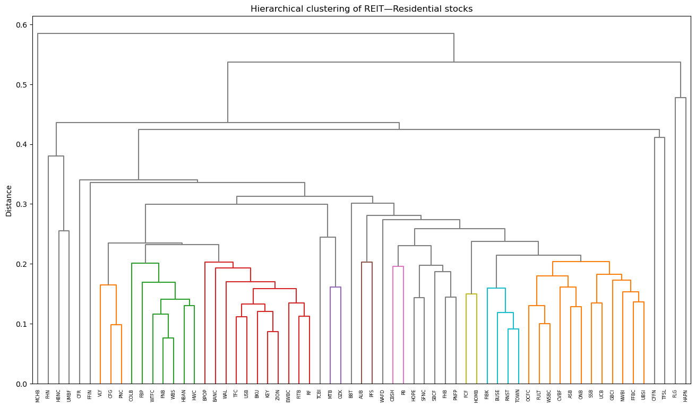

##### 2. Analysis

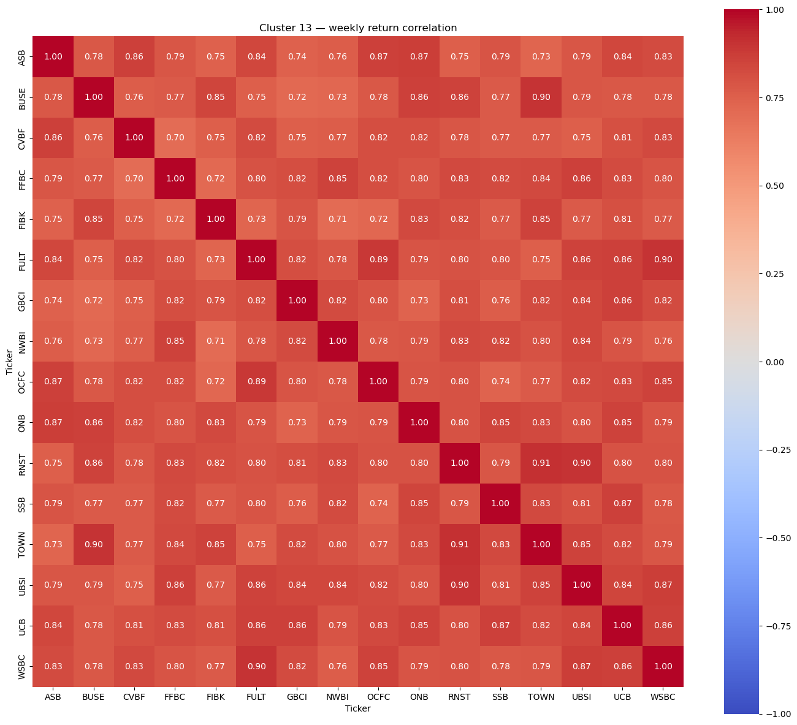

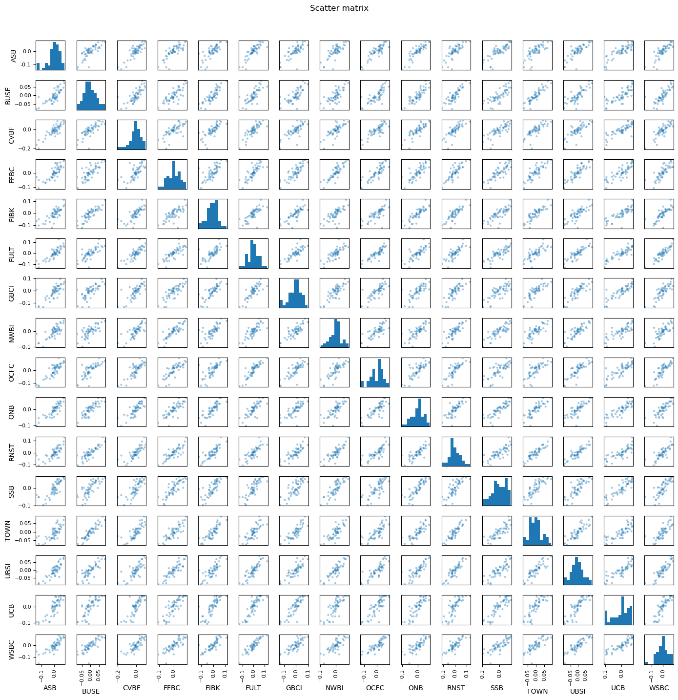

After running this clustering algorithm through all the selected industries, it did not yield any good results. Despite the fact that the stocks were highly correlated, a highly correlated cluster did not mean a good performance on the trading algorithm. This means that correlation alone is not a strong enough metric to choose a well performing cluster for this algorithm, and further optimisation to the clustering procedure can be done in the future. Since by this point I had found a collection of stock where my algorithm worked, the `REIT-Residential` sector, I decided to move on from clustering and start working meta-labelling.

## Base Trading Strategy

### Strategy Logic

The base strategy is single-cluster mean reversion, taken from _[151 Trading Strategies](https://ssrn.com/abstract=3247865)_ (p. 46–47) and implemented in `backtest.py` so it could be reused in `meta-labelling.ipynb`.

#### How it works

1. At the end of each week, calculate the return for each stock in the cluster.
2. Compute the average return for the entire cluster.
3. For each stock, calculate the **residual**: its individual return minus the cluster average return.
4. Identify stocks with very negative residuals (underperformed the group) — these are candidates to **buy**.
5. Identify stocks with very positive residuals (outperformed the group) — these are candidates to **short**.
6. Adjust position sizes so that the total value of long and short positions are equal, keeping the portfolio dollar-neutral.
   For a more mathematical explanation of the strategy I recommend reading the _[151 Trading Strategies](https://ssrn.com/abstract=3247865)_ paper.

#### 12 Year Backtest

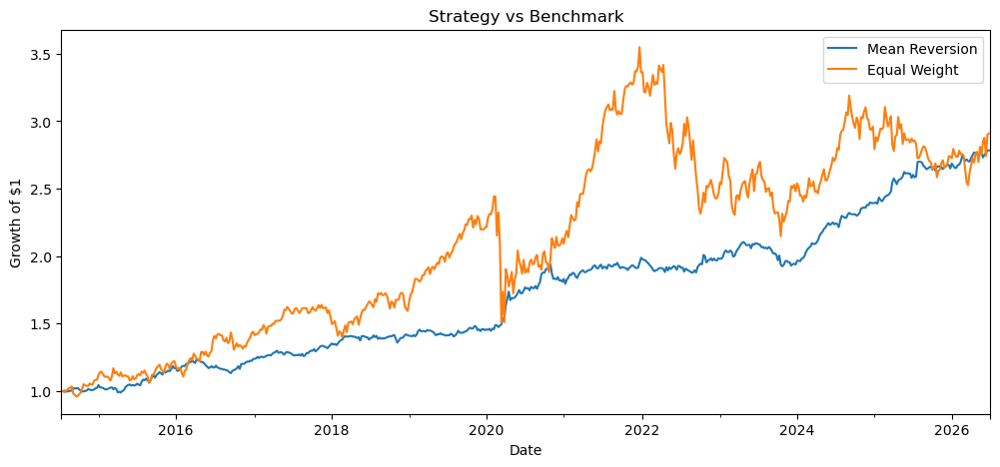
Running this on ~12 years of weekly data with no transaction costs gave a **178% total return, 1.28 Sharpe, and only -8.6% max drawdown**, against an equal-weight buy-and-hold benchmark of 190% return but a much rougher -39.5% drawdown and 0.52 Sharpe.

#### 3-Year Chunk Backtest

  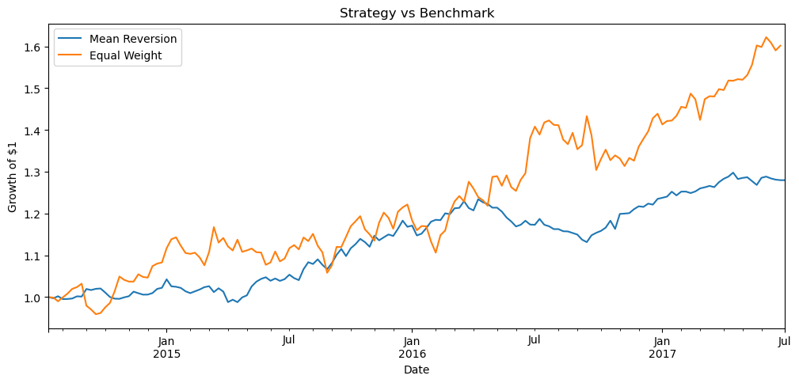
  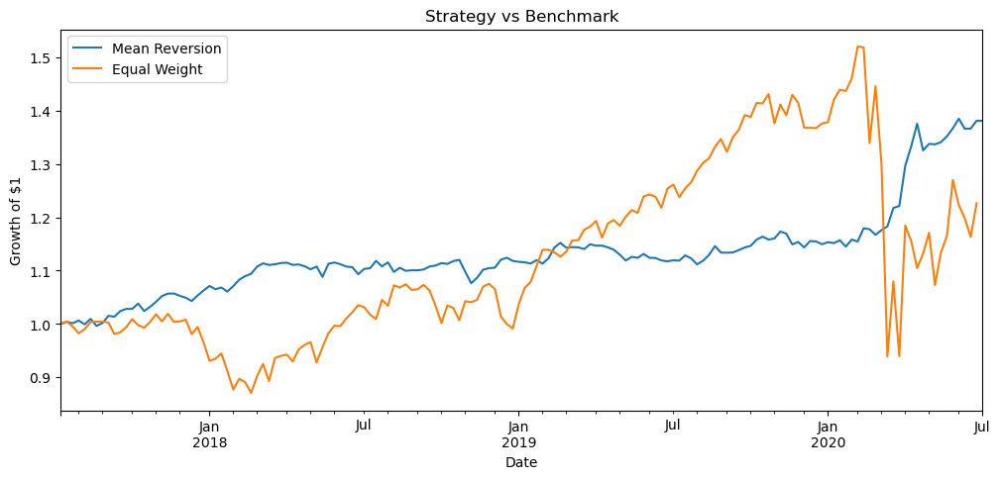
  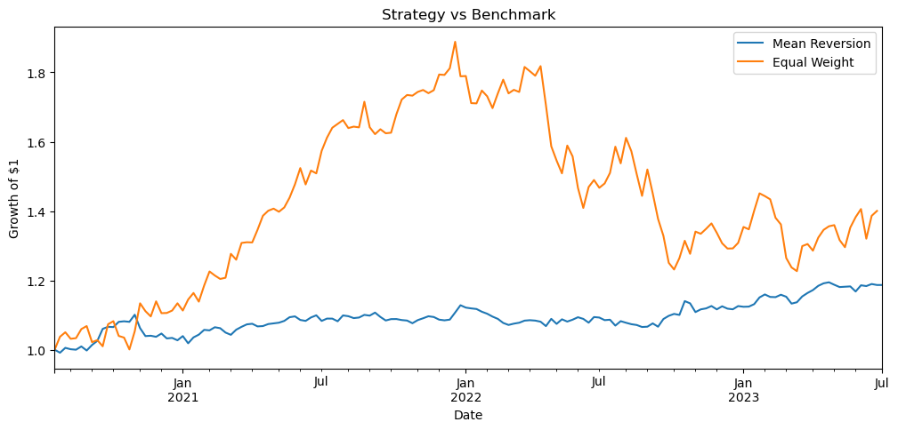
  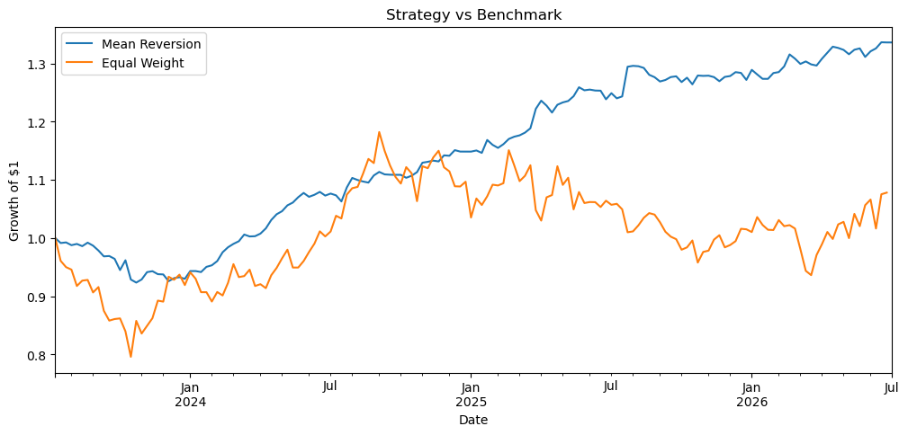

I split the 12 years into four 3-year chunks to test my strategy further. The strategy held up in three of them (~1.45 average Sharpe), but dropped to 0.84 Sharpe in 2020–2023, likely because of the pandemic.

#### Leave-one-out Backtest

To ensure that the success of this cluster didn't rely solely on one stock performing well, I ran the backtest on the same cluster of stocks, iteratively removing one of them each time. The results are below:

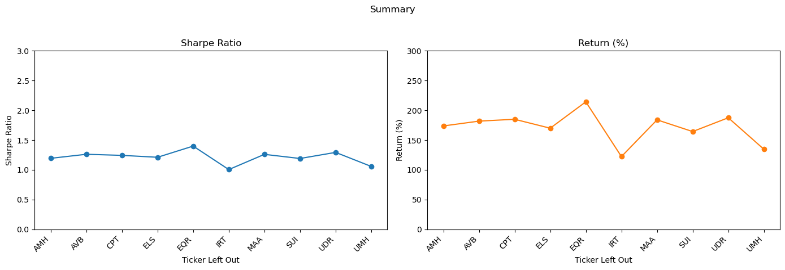

The ticker symbol that was omitted from each backtest is labelled at the bottom. From the results it is clear that no single stock significantly worsened the strategy upon removal, hence the strategy is quite stable.

### Trade-Size Threshold (Tau)

Due to the nature of this strategy, it has to rebalance every week. Hence, transaction costs add up very fast.

I tested 5, 10 and 20 bps transaction costs.

  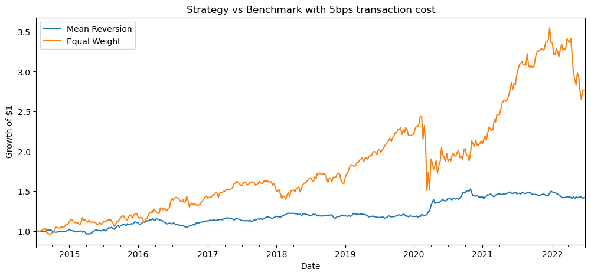
  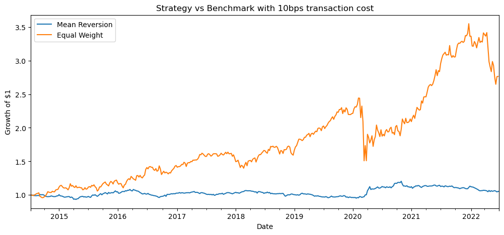
  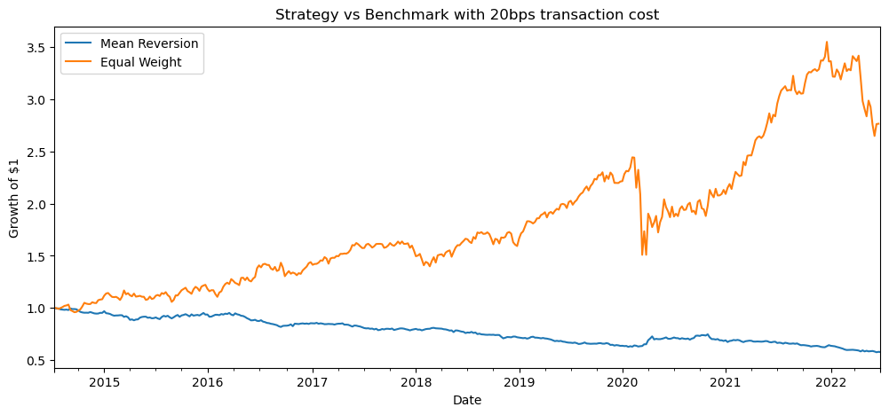

At 5 bps the strategy still performed alright, but at 10 and 20 bps it performed significantly worse than the basic buy-and-hold benchmark.

Before implementing the machine learning models, I decided to improve this strategy by adding a residual threshold: the residual from week to week has to be larger than a `tau` to be accepted. Otherwise, the position for that stock in that week is 0. With this I aimed to minimise the transaction costs before training any models. To pick `tau` without any look-ahead bias, I used a walk-forward approach where for each evaluation year, I chose a `tau` using only the _previous three years_ of data:

| Evaluation period | Tau-selection period |
| ----------------- | -------------------- |
| 2019              | 2016–2018            |
| 2020              | 2017–2019            |
| ...               | ...                  |
| 2026 YTD          | 2023–2025            |

For each candidate `tau`, I backtested the full three years and checked its Sharpe year by year. A candidate was only eligible if it beat `tau = 0` in at least two of those three years, and among eligible candidates I picked the one with the best combined three-year Sharpe (ties going to the smaller `tau`).

### Full Backtest Results (including threshold `tau`)

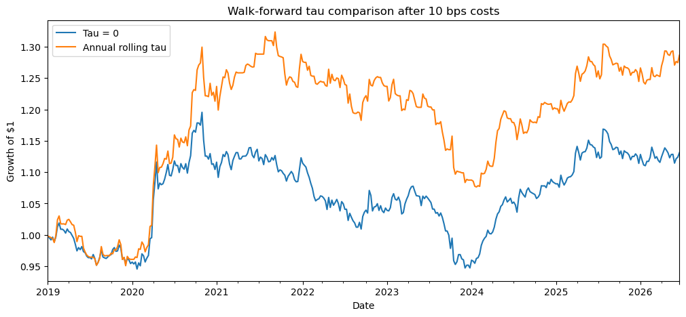

#### Chosen Tau by Year

| Year     | Tau   |
| -------- | ----- |
| 2019     | 0.01  |
| 2020     | 0.015 |
| 2021     | 0.015 |
| 2022     | 0.015 |
| 2023     | 0.015 |
| 2024     | 0.015 |
| 2025     | 0.005 |
| 2026 YTD | 0.01  |

After backtesting each outer year with its own selected `tau` (using a 10 bps transaction cost, which mimics a real trading environment), I found that this approach clearly outperformed simply accepting every trade. The annual rolling `tau` delivered a **28.6% return, 0.46 Sharpe, and -18.7% max drawdown**, compared to **13.1% return, 0.26 Sharpe, and -20.8% max drawdown** for `tau = 0`.

## Machine-Learning Trade Filter

### Feature Engineering and Meta-Labels

In a nutshell, this is how meta-labelling works. The base strategy decides what trade to make (long/short for each stock), and the ML model decides whether to _take_ it or not. So each proposed trade gets a label based on what actually happened the following week — success (1) if a long went up or a short went down, failure (0) otherwise.

For features, I started with the following 9:

- `side` — long or short
- `abs_base_weight` — how large the position is relative to the £10,000 portfolio
- `residual_zscore` — how unusual this week's residual is versus the rest of the cluster
- `residual_lag1` — last week's residual for the same stock
- `residual_4w_sum` — the residual summed over the last 4 weeks
- `residual_vol_4w` — how volatile the residual has been over the last 4 weeks
- `stock_vol_4w` — the stock's own return volatility over the last 4 weeks
- `cluster_return` — how the whole REIT group did that week
- `cluster_vol_4w` — how volatile the whole group has been recently

### Hyperparameter Optimisation

Before walk-forward, I did a simpler "development" pass: train on 2015–2017, validate on 2018, and see how Logistic Regression, Random Forest and XGBoost compare and tune their hyperparameters.

- **Logistic Regression** was used as a baseline with no tuning, as it did not have any hyperparamters except `n_iterations` and `solver`, which did not impact the result too much.
- **Random Forest**: Tuned over 90 candidates (`n_estimators`, `max_depth`, `min_samples_leaf`). Picking by validation AUC alone overfit badly — top candidates had big training/validation gaps (for example training accuracy around 0.99 and validation accuracy around 0.5). So I filtered out anything with `train_auc - val_auc > 0.15`, then took the best val AUC left.
- **XGBoost** was tuned over a smaller grid of 6 candidates.

On this fixed split, the validation AUCs ended up close to random chance for all three models (Logistic Regression 0.522, Random Forest 0.539, XGBoost 0.517). Although this isn't a great ML result, this does not mean the model will perform badly on the backtest.

### Walk-Forward Model Training

The steps for walk-forward are as follows:

For each validation year 2019-2026:

1. Reuse that year's `tau` that was picked in `backtesting.ipynb`.
2. Threshold the previous four years of trades using that `tau`.
3. Train each model on each of the previous four years.
4. Pick one probability cutoff per model using only the last **two** of the four years — whichever cutoff gives the best combined historical Sharpe wins, ties go to the lower cutoff.
5. Refit the model on all four historical years using the selected probability, predict the next year once, rescale back to dollar-neutral, and backtest it.

### Performance Evaluation

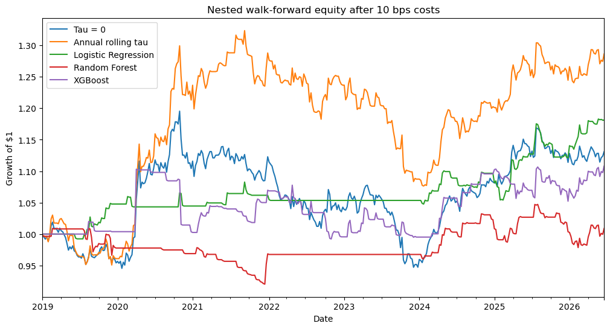

Stitching all four outer years (2023–2026 YTD) together at 10 bps cost:

| Strategy                   | Return | Sharpe   | Max Drawdown | Active Weeks |
| -------------------------- | ------ | -------- | ------------ | ------------ |
| Tau = 0 (take every trade) | 13.1%  | 0.26     | -20.8%       | 390          |
| Annual rolling tau         | 28.6%  | 0.46     | -18.7%       | 296          |
| Logistic Regression        | 18.1%  | **0.64** | **-4.6%**    | 79           |
| Random Forest              | 0.9%   | 0.05     | -8.8%        | 91           |
| XGBoost                    | 10.8%  | 0.24     | -10.1%       | 123          |

Logistic Regression came out on top by a decent margin on Sharpe and drawdown, despite having the weakest validation AUC during hyperparameter development. The next runner up based on the Sharpe is the Annual rolling tau, where no ML model made trading decisions, and instead we simply applied the tau selected for each year to filter the trades. Unfortunately, both Random Forest and XGBoost performed even worse than just the base strategy, with lower Sharpe _and_ lower return in the end.

## Conclusion

### Results Reflection

Although the final results were not extremely impressive, I was still very satisfied that the base strategy was profitable and that Logistic Regression improved its Sharpe ratio from 0.46 to 0.64. It also reduced the maximum drawdown from -18.7% to -4.6%, although this came at the cost of a lower overall return and fewer active trading weeks. This shows that the model did not simply make the strategy more profitable, but instead it made it more selective and improved its risk-adjusted performance.

I also found it interesting that the simplest model produced the best result. Random Forest and XGBoost performed worse than the base strategy, despite being more complex. This showed me that a more advanced model is not automatically a better model, especially when the available dataset is relatively small. In fact, in this case a simpler model provides a better result **and** higher interpretability.

Since this was my first finance and machine learning project, the experiment was not perfect, and there are several ways in which it could be made more robust. Therefore, I would not treat these results as proof that meta-labelling is always effective, however the results do provide a small practical example of how meta-labelling can improve certain strategy metrics. This is consistent with the findings discussed by Ashutosh Singh and Jacques Joubert in [Does Meta Labeling Add to Signal Efficacy?](https://hudsonthames.org/does-meta-labeling-add-to-signal-efficacy-triple-barrier-method/).

### Personal Reflection

Throughout this project, I learnt a lot about machine learning, trading strategies, backtesting and financial data. I also learnt how easy it is to produce misleading results through overfitting, look-ahead bias or unrealistic assumptions about transaction costs. One of my biggest takeaways is that training a model on financial data is incredibly hard: financial markets are unpredictable, there is sometimes a lack of training data (since different market regimes behave differently), and you have to use a complex process of walk-forward validation. This becomes even more complex when you also implement hyperparameter optimisation or model tuning into it as well.

Most importantly, this project confirmed that I want to explore quantitative research further. I very much enjoyed how the field combines mathematics, computer science and finance, while still requiring personal judgement about data, as well as an in-depth understanding of finance and financial markets.

### Limitations and Potential Improvements

- **Stock selection was correlation-based.** For a strategy that depends on mean reversion, cointegration might be a more honest metric than correlation, and clustering could've yielded better results.
- **Small dataset.** Only 10 stocks and roughly four years of history feed each walk-forward training window, which likely explains why Random Forest and XGBoost's validation AUCs bounced around so much between candidates.
- **Features were a first pass.** The 9 features were simply just a personal best guess, and there is definitely more feature engineering work to be done to extract features that actually make a difference.
- **Only one industry tested.** REIT — Residential worked out, but it would be worth testing whether the same pipeline (strategy + tau + meta-labelling) holds up on a different sector, especially after polishing up the stock clustering pipeline.
